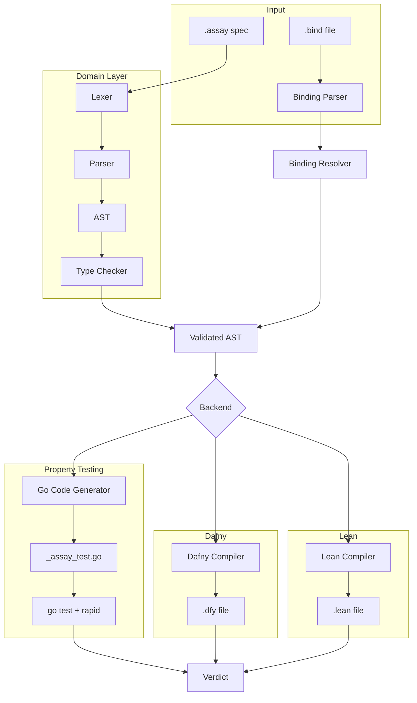

# assay

  

## Problem

LLMs are collapsing the cost of generating proofs and implementations. When proofs are cheap, the bottleneck shifts to specifications.

## Solution

Assay is a standalone specification language for software behavior with pluggable verification backends. The spec language is the domain. Verification backends are infrastructure. Same spec, different guarantee levels; from probabilistic (property testing) to mathematical (formal proof).

Assay separates three concerns:

1. **Specification** — what should this system do? (`.assay` file)
2. **Binding** — how does the spec connect to an implementation? (`.bind` file)
3. **Verification** — does the implementation satisfy the spec? (backend)

## Architecture

## Usage

Coming soon.
