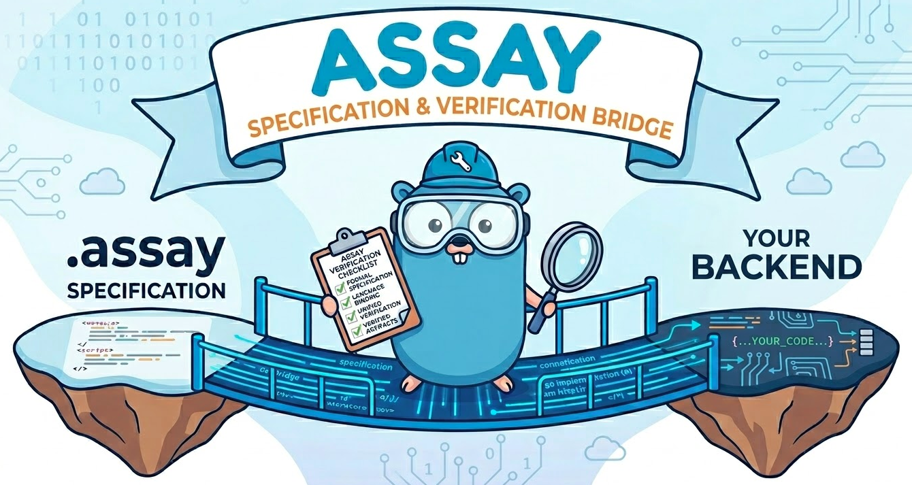
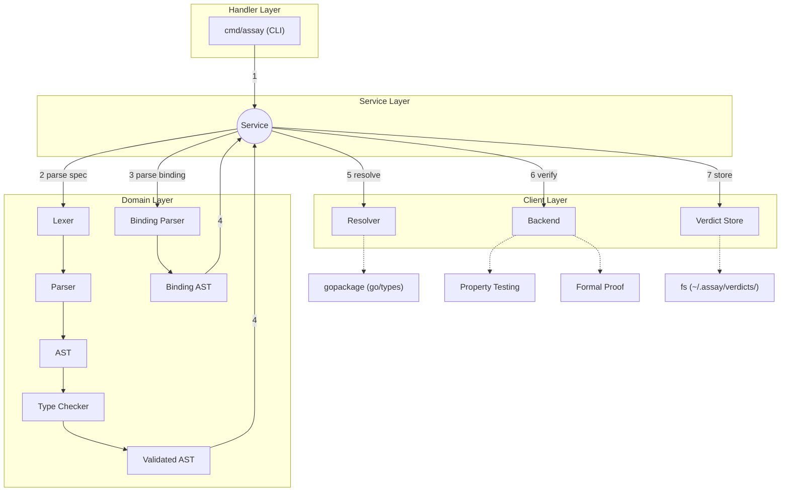

# assay

  

## Problem

LLMs are collapsing the cost of generating proofs and implementations. When proofs are cheap, the bottleneck shifts to specifications.

## Solution

Assay is a standalone specification language for software behavior with pluggable verification backends. The spec language is the domain. Verification backends are plug and play. Same spec, different guarantee levels; from probabilistic (property testing) to mathematical (formal proof).

|                       | property testing                  | formal proof (model)                               | formal proof (native)                   |
| --------------------- | --------------------------------- | -------------------------------------------------- | --------------------------------------- |
| **Backend generates** | e.g., go test file + test results | e.g., dafny scaffolding + theorems + proof results | e.g., verus annotations + proof results |
| **Proofs about**      | real code (directly)              | model of code                                      | real code (directly)                    |
| **Trust gap**         | none                              | model ↔ code                                       | none                                    |
| **Guarantee**         | probabilistic                     | mathematical (of model)                            | mathematical (of code)                  |

## Architecture

## Usage

Coming soon.
